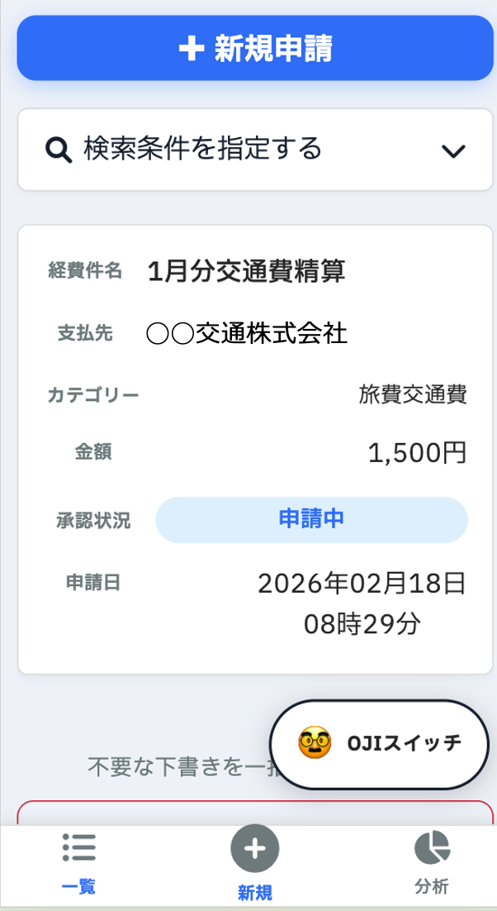
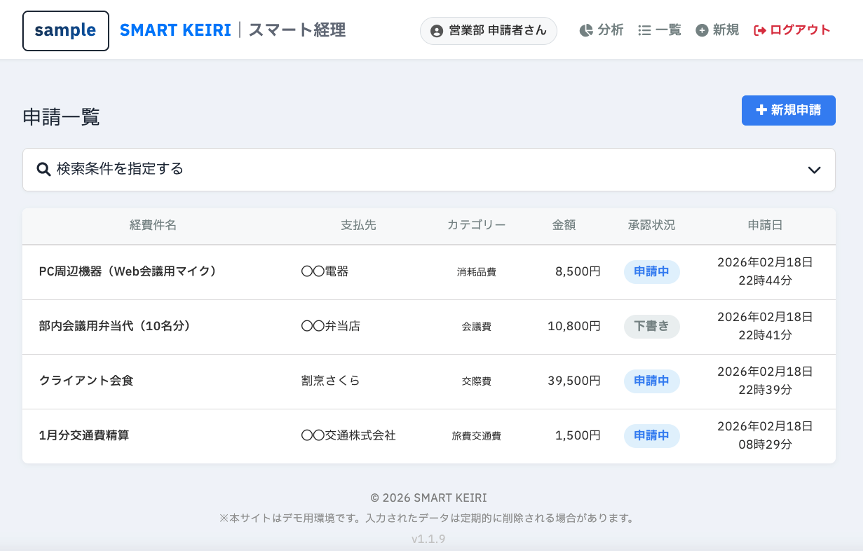
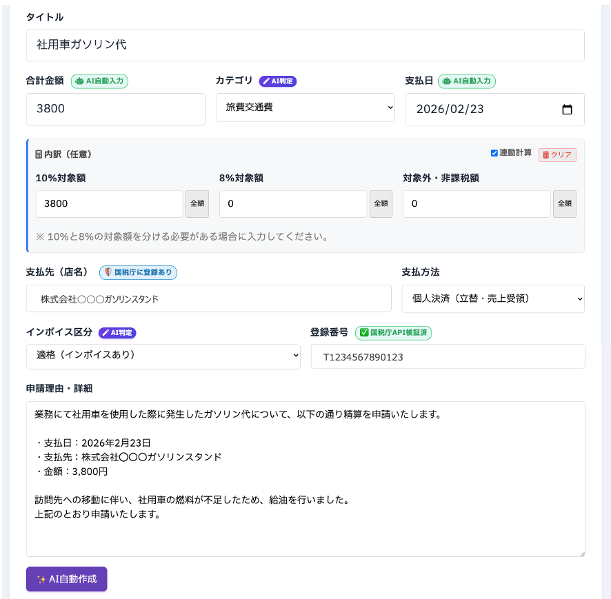

# SMART KEIRI｜スマート経理　


> **会計ソフトに渡すデータを完璧にする、AI仕訳・経費管理システム**

> **⚠️ これはデモです。実際のセールスは行っていません。**
> **Note: This repository contains documentation only.**
> 
> 本レポジトリは、**SMART KEIRI** の仕様・設計思想・リリースノートを公開するためのドキュメント用レポジトリです。
> ソースコード本体は、セキュリティおよび商用ライセンスの都合上、Privateレポジトリにて厳重に管理・運用されています。


---

## 📖 サービス概要

**SMART KEIRI（スマート経理）** は、従業員10〜50名規模の中小企業を対象とした、**シングルテナント型** の経費精算・承認ワークフローシステムです。

「小さな文字が苦手、だからこそ見やすさを極める」という実感をベースに、徹底的な視認性を追求した **OJI-UX（Optimal Judicious Interface）** を採用。最新の **Google Gemini 3.0 Flash** を活用した領収書解析（OCR）と、国税庁API連携によるインボイス監査機能を統合しています。

### コンセプト：現場で止まらないUX
大手SaaSのような多機能さではなく、**「経理1名・社長兼務」** の現場で、月末の事務作業を確実に終わらせるための「迷わない仕組み」を提供します。

## 📸 スクリーンショット

### 📱 OJI-UX (Mobile Experience)
「視認性を極限まで高めること」を追求した、独自のインターフェース設計です。

<table>
  <tr>
    <th width="33%">1. Home & Camera</th>
    <th width="33%">2. 通常モード</th>
    <th width="33%">3. 👴 OJIスイッチ</th>
  </tr>
  <tr>
    <td align="center"></td>
    <td align="center"></td>
    <td align="center"></td>
  </tr>
  <tr>
    <td align="center">迷わず押せる撮影ボタン</td>
    <td align="center">一般的なSaaSの文字サイズ</td>
    <td align="center">スイッチONで文字が極大化</td>
  </tr>
</table>

### 💻 ダッシュボード (PC View)
経理担当者向けの管理画面は、視認性と情報の網羅性を両立させています。



---

## 🚀 主な機能 (Features)

### ✨ AI 領収書解析 (Gemini 3.0 Flash OCR)
- **超高速OCR**: 最新の LLM (`Gemini 3.0 Flash`) を採用し、画像から金額・日付・支払先・インボイス番号を即座に抽出。
- **スマート税率分割**: 10%と8%（軽減税率）が混在するレシートを自動計算し、内訳を自動入力。
- **AI 信頼度スコア**: AIがどれだけ自信を持って読み取ったかを可視化し、確認すべき箇所をナビゲート。

### ⚖️ 法制度・コンプライアンス対応
- **インボイス制度 (国税庁API連携)**:
    - 読み取ったT番号を国税庁データベースとリアルタイム照合し、事業者名を自動検証。
- **電子帳簿保存法**:
    - 訂正・削除の履歴（監査ログ）を完全記録。
    - **月次締め機能** により、確定した過去データの改ざんをシステムレベルでロック。
- **合計残高試算表 (Trial Balance)**:
    - 月次単位での集計・フィルタリング。経理担当者が使い慣れた「鏡合わせ」のレイアウトで精度の高い月次決算をサポート。

### 📱 究極のモバイル体験 (OJI-UX)
- **OJI-UX Toggle (おじさまスイッチ)**:
    - ワンタップで「標準表示」と「超拡大表示」を切り替え。
    - 独自の巨大フォント設計とコントラスト調整により、ハッキリした視認性を確保。
- **スマホ専用撮影モード**: ブラウザからカメラを直接起動し、撮影→解析→申請までを最短フローで完結。

---

## 📂 System Architecture

堅牢な Django プロジェクト構成を採用し、機能ごとにアプリケーションを疎結合に分割しています。

```text
smart-keiri/
├── config/             # プロジェクト設定・ミドルウェア (Settings)
├── cases/              # 経費精算コアロジック (Domain Layer)
│   ├── models/         # 申請・承認・履歴管理・仕訳モデル
│   ├── services/       # Gemini AI解析・国税庁API連携ロジック
│   └── views/          # OJI-UX & 会計集計の実装
├── templates/          # OJI-UX フロントエンドテンプレート
├── static/             # 静的ファイル (CSS/JS/Chart.js)
├── requirements.txt    # 依存ライブラリ (google-genai, pillow, psycopg2等)
└── .env.example        # 環境変数定義
```

## 🛠 技術スタック (Tech Stack)

| Category | Technology |
| :--- | :--- |
| **Backend** | Python 3.11+, Django 5.x |
| **Database** | PostgreSQL (Production), SQLite3 (Demo) |
| **AI / OCR** | **Google Gemini 3.0 Flash** (via `google-genai` SDK) |
| **Gov API** | 国税庁 インボイス制度 適格請求書発行事業者公表システム Web-API |
| **Frontend** | Vanilla JS, CSS (No Framework), Chart.js v4 |
| **Infra** | Linux VPS (Single Tenant), Nginx, Gunicorn |

---

## 📝 Release Notes (History)

### v1.2.0 (2026/02/21)
- **管理者による直接修正機能**: 承認済み案件でも管理者が内容を最終調整可能に（履歴自動記録・仕訳同期）。
- **ユーザーメニューの最適化**: ヘッダーのドロップダウン化により、管理者メニューが増えてもレイアウトが崩れないモダンなUIを実現。
- **合計残高試算表の強化**: 月次フィルタの実装と、締め状態の可視化。
- **設計思想の明文化**: 「小さな文字を排除する」視点に基づいた OJI-UX の定義を刷新。

### v1.1.9 (2026/02/16)
- **パスワードリセット機能**: 安全なリカバリーフローの実装。
- **画像回転**: 申請詳細画面からの領収書向き修正機能を追加。

### v1.1.7 (2026/02/14)
- **弥生会計対応**: `freee` `MF` に加え、`弥生会計` 形式でのCSVエクスポートを実装。
- **マスターデータ管理**: 部署・カテゴリー・ユーザーの一括インポート/エクスポート。

### v1.1.5 (2026/02/11)
- **インフラ最適化**: サーバー側画像圧縮によるストレージ効率化。
- **Gemini SDK移行**: 最新の `google-genai` クライアントへ移行。

### v1.1.4 (2026/02/09)
- **OJI-UX Toggle 実装**: モバイル画面での「標準/拡大」即時切替スイッチを搭載。
- **フォント最適化**: `IBM Plex Sans JP` を採用。

### v1.0.0 (2026/02/03)
- **Initial Release**: サービスローンチ。

---

## 📬 Contact / 導入のご相談

本システムは、設計から運用保守までを一貫して提供する **「顔の見えるSaaS」** です。
現在はデモとして構築しており、セールスは行っていません。
